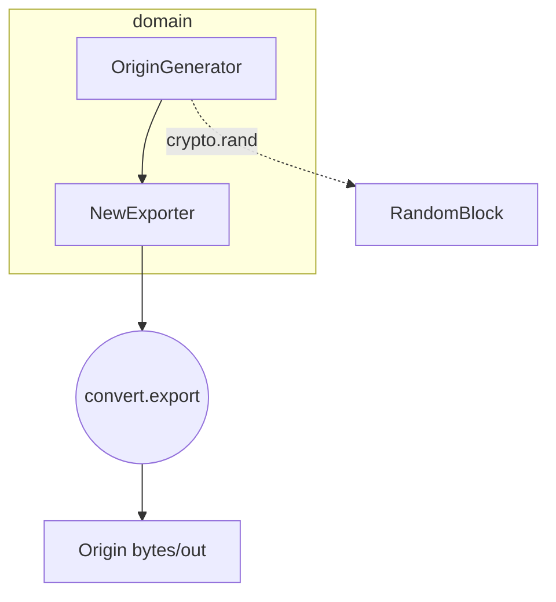
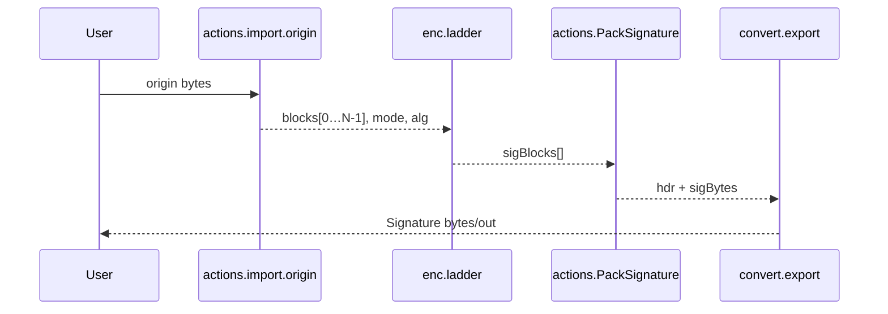

# 1 Introduction  

**UldaSign** is the *reference* JavaScript implementation of the digital-signature method used in **ULDA — Universal Linear Data Auth**.  
Designed for laboratory evaluation, rapid prototyping and comparative analysis of ULDA parameters, the code has **no external run-time dependencies** except for *optional* user-supplied hash functions that can be fetched from a CDN.   

## 1.2 Brief overview of the S- and X-ladder protocols  

| Protocol | Construction principle | Resulting properties |
|----------|-----------------------|----------------------|
| **S-ladder (Sequential)** | Each block `blockᵢ` is iteratively hashed *i* times: `hashⁱ(blockᵢ)`. All intermediate digests are stored in the signature. | Straight-line verification of arbitrarily distant generations; signature size grows linearly with *N*. |
| **X-ladder (Cross)** | On every depth *d* the concatenation of two neighbouring blocks is hashed: `hash(blockᵢ ∥ blockᵢ₊₁)`, forming a tree of depth *N − 1*. | More compact signature; verification of generation *k + 1* requires generation *k*. |

The desired ladder type is selected via the constructor field `sign.mode` (`"S"` | `"X"`). :contentReference[oaicite:3]{index=3}  

## 1.3 Key capabilities of the implementation  

* **Origin generation (`New`)** – produces an array of *N* pseudo-random blocks of size `originSize` bits and packs them into a self-contained binary container.  
* **Incremental update (`stepUp`)** – discards the oldest Origin block, appends a new random block and increments the generation counter; all previous signatures remain valid.  
* **Signature creation (`sign`)** – applies the chosen ladder algorithm and serialises the result in `hex`, `base64` or `bytes` format, according to `fmt.export`.  
* **Integrity check (`verify`)** – confirms that signature *B* is the direct successor of signature *A* (for *S* or *X* mode) or rejects the chain unambiguously.  
* **Pluggable hash functions** – arbitrary digest algorithms can be registered via the `externalHashers` map; the class automatically verifies output length and supports `bytes`, `hex` or `base64` return types.  
* **Minimal public API** – only five methods are exposed: `New`, `stepUp`, `sign`, `verify`, and the static helper `loadScriptOnce`, simplifying both formal specification and security analysis. :contentReference[oaicite:4]{index=4}  


## 2 Getting Started

> This chapter shows how to obtain **UldaSign**, launch the reference build in typical environments, and understand every configuration flag.<br>
> Sections for **npm** and **CDN** delivery are placeholders until the artefacts are published.

---

### 2.1 Installation

| Method | Instruction |
|--------|-------------|
| **npm** | *coming soon* |
| **CDN** | *coming soon* |
| **Local script (development build)** | 1. Copy `main.js` next to your HTML page.<br>2. Load it **before** your own code (see the snippet below). |

```html
<!-- UldaSign reference build -->
<script src="main.js"></script>
<script>
  /* your app */
</script>
```

---

### 2.2 Quick smoke test (in-browser)

```html
<script src="main.js"></script>
<script>
  const signer = new UldaSign({
    fmt : { export : 'hex' },           // hex | base64 | bytes
    sign: { N: 5, mode: 'X', hash: 'SHA-256', originSize: 256 }
  });

  (async () => {
    const origin0 = await signer.New();        // generation 0
    const sig0    = await signer.sign(origin0);

    const origin1 = await signer.stepUp(origin0);
    const sig1    = await signer.sign(origin1);

    console.log(await signer.verify(sig0, sig1)); // → true
  })();
</script>
```
A similar pattern is demonstrated in the bundled `index.html`. 

---

### 2.3 Running the demo page

Open **index.html** in any modern browser and watch the console output.  
The script continuously generates *Origin / Signature* pairs and prints `verify()` results for successive generations. 

---

### 2.4 Node.js usage

```js
import UldaSign from './main.js';      // adjust the path if necessary

const signer = new UldaSign({ sign: { N: 3 } });

const origin = await signer.New();
console.log(await signer.sign(origin));
```
> **Note:** If you rely on custom hash functions in Node .js, register them via `externalHashers`. Browser-only APIs such as `crypto.subtle.digest` are **not** available in vanilla Node.

---

### 2.5 Configuration reference

| Path | Type / Allowed values | Default | Description |
|------|----------------------|---------|-------------|
| `version` | `string` | `"1"` | Binary-header revision (change **only** if you alter the on-wire layout).  |
| `fmt.export` | `'hex'` \| `'base64'` \| `'bytes'` | `"hex"` | Serialisation format for `Origin` and `Signature`.  |
| `sign.N` | `integer ≥ 2` | `5` | Ladder length (number of Origin blocks). Affects signature size and chain lifetime.  |
| `sign.mode` | `'S'` (sequential) \| `'X'` (cross) | `'S'` | Ladder construction algorithm (see § 1.2).  |
| `sign.hash` | Built-ins: `"SHA-1"`, `"SHA-256"`, `"SHA-384"`, `"SHA-512"`, `"SHA3-256"`, `"SHA3-512"`, `"BLAKE3"`, `"WHIRLPOOL"` – **or** any custom short name | `"SHA-256"` | Digest algorithm. Custom names must be registered via `externalHashers`.  |
| `sign.originSize` | `integer` (bits) | `256` | Size of each Origin block. In **X-mode** this **must equal** the digest length of `sign.hash`.  |
| `sign.pack` | `'simpleSig'` | `"simpleSig"` | Packing strategy for the signature payload (reserved).  |
| `sign.func` | `async (Uint8Array) → Uint8Array \| string` | — | Raw hashing callback for **custom** algorithms. Registered implicitly when present.  |
| `sign.output` | `'bytes'` \| `'hex'` \| `'base64'` | `'bytes'` | Output format produced by `sign.func`; auto-converted to bytes.  |
| `sign.size` | `integer` (bits) | — | Expected digest length for custom hashes; enforced at run-time if provided.  |
| `sign.cdn` | `string` (URL) | — | Script exporting `sign.func`, loaded on first use.  |
| `externalHashers` | `object` `{ id → { fn, output, size, cdn } }` | `{}` | Pre-register multiple custom hashes at construction time.  |

#### Example – registering a custom hash

```js
import * as hashwasm from 'hash-wasm';    // any WASM digest library

const cfg = {
  fmt : { export : 'bytes' },
  sign: {
    N: 5,
    mode: 'X',
    hash: 'WHIRLPOOL',          // identifier you will use later
    originSize: 512,            // must equal digest size
    func  : async u8 => hashwasm.whirlpool(u8),
    output: 'hex'               // format returned by the function
  }
};

const signer = new UldaSign(cfg);
```

When `sign()` is invoked for the first time, **UldaSign** wraps the custom function, converts its output to bytes, checks `size` (if supplied) and then proceeds exactly as with the built-in algorithms.

---

With these settings you can fine-tune **UldaSign** for almost any laboratory scenario: vary the chain length, switch between *S*- and *X*-ladders, benchmark different digest algorithms or plug in post-quantum candidates – all without changing application code.


# 3 Configuration (`cfg`)

> All behaviour of **UldaSign** is driven by a single configuration object
> that you pass to the constructor.<br>
> This chapter specifies every field, its default, validation rules and
> several ready‑to‑use recipes.  :contentReference[oaicite:6]{index=6}

---

## 3.1 Default object (reference build)

The constructor merges your input with the defaults below:

```json
{
  "version": "1",
  "fmt":   { "export": "hex" },
  "sign":  {
    "N": 5,
    "mode": "S",
    "hash": "SHA-256",
    "originSize": 256,
    "pack": "simpleSig",

    /* custom‑digest descriptors (optional) */
    "func": null,
    "output": "bytes",
    "size": null,
    "cdn": null
  },

  /* optional bulk registration */
  "externalHashers": {}
}
```

Any field you omit inherits the value shown above.  
Unknown properties are ignored for forward compatibility.

---

## 3.2 `fmt` — serialisation options

| Field | Allowed values | Default | Effect |
|-------|----------------|---------|--------|
| `export` | `'hex'` \| `'base64'` \| `'bytes'` | `'hex'` | Output format for `New`, `sign`, `stepUp`; determines the parser used by `verify`. :contentReference[oaicite:7]{index=7} |

---

## 3.3 `sign` — ladder‑engine parameters

### 3.3.1 Core fields

| Field | Type / Range | Default | Description |
|-------|--------------|---------|-------------|
| `N` | integer ≥ 2 | `5` | Number of **Origin** blocks; upper bound on chain lifetime. |
| `mode` | `'S'` (sequential) \| `'X'` (cross) | `'S'` | Ladder construction algorithm (see § 1.2). |
| `hash` | built‑in ID or custom string | `'SHA‑256'` | Digest used by the ladder engine. |
| `originSize` | integer (bits) | `256` | Size of each Origin block.<br>**Must equal** digest length in **X‑mode**. |
| `pack` | `'simpleSig'` | `'simpleSig'` | Signature‑payload layout (reserved for future use). |

### 3.3.2 Digest selection

*Built‑in identifiers*  
`"SHA‑1"`, `"SHA‑256"`, `"SHA‑384"`, `"SHA‑512"`,  
`"SHA3‑256"`, `"SHA3‑512"`, `"BLAKE3"`, `"WHIRLPOOL"` :contentReference[oaicite:8]{index=8}

*Custom identifier* — any short string not colliding with the list above.

If you choose a custom ID, supply **at least one** of the descriptors below:

| Descriptor | Purpose | Required? |
|------------|---------|-----------|
| `func` | `async (Uint8Array) → Uint8Array \| string` | yes (if no `cdn`) |
| `cdn` | URL exporting `func` | yes (if no `func`) |
| `output` | `'bytes'` \| `'hex'` \| `'base64'` | **always** |
| `size` | integer (bits) | recommended (enforced at run‑time) |

`UldaSign` converts `output` to raw bytes and checks `size` before use.  
If the digest is missing or returns the wrong length, the class throws:

* `Hasher &lt;id&gt; not registered` — unknown `hash` :contentReference[oaicite:9]{index=9}  
* `Hasher &lt;id&gt; size mismatch` — digest length ≠ `size` :contentReference[oaicite:10]{index=10}

### 3.3.3 Validation flow

1. Constructor fills defaults, then stores the merged object.  
2. During **X‑mode** verification, `originSize` ≡ digest length; mismatch causes `verify()` to return `false`. :contentReference[oaicite:11]{index=11}  
3. All binary importers (`import.origin`, `import.signature`) check header markers, block counts and lengths; violations throw:  
   * `"sentinel"` — leading/trailing marker ≠ 0  
   * `"div"` — body length not divisible by `N`  
   * `"SigImporter sizes"` — signature payload inconsistent with `originSize` / `N`

---

## 3.4 `externalHashers` — bulk registration map

Use this map to preload several custom digests at once:

```js
const cfg = {
  sign: { hash: 'BLAKE3' },         // default digest for this run
  externalHashers: {
    WHIRLPOOL: {                    // override built‑in
      output: 'hex',
      size:   512,
      cdn:    'https://cdn.example.com/whirlpool.js'
    },
    MYHASH: {
      func:   async u8 => myHash(u8),
      output: 'bytes',
      size:   256
    }
  }
};
```

The descriptor format is **identical** to § 3.3.2.

---

## 3.5 Ready‑to‑use configuration recipes

### 3.5.1 Minimal secure setup (built‑in SHA‑256)

```js
new UldaSign({
  sign: { N: 10 }     // everything else = defaults
});
```

### 3.5.2 Long sequential chain (32 blocks, BLAKE3, raw bytes)

```js
new UldaSign({
  fmt : { export: 'bytes' },
  sign: { N: 32, mode: 'S', hash: 'BLAKE3', originSize: 256 }
});
```

### 3.5.3 Custom digest via direct `func` (Whirlpool, 512‑bit)

```js
import * as hashwasm from 'hash-wasm';

new UldaSign({
  fmt : { export: 'bytes' },
  sign: {
    N: 5,
    mode: 'X',
    hash: 'WHIRLPOOL',
    originSize: 512,                 // equals digest size
    func:   async u8 => hashwasm.whirlpool(u8),
    output: 'hex'                    // function returns hex string
  }
});
```

### 3.5.4 Digest loaded on demand from CDN (PQ candidate)

```js
new UldaSign({
  sign: {
    N: 7,
    mode: 'X',
    hash: 'SPHINCS-SHAKE',
    originSize: 256,
    cdn:   'https://cdn.example.com/sphincs-shake.js',
    output:'bytes',
    size:  256
  }
});
```

At first `sign()` call **UldaSign** fetches the script once, registers
`SPHINCS‑SHAKE` and proceeds as with built‑ins.

---

## 3.6 Error table (configuration phase)

| Condition | Thrown value / effect |
|-----------|----------------------|
| Unknown `hash` ID during hashing | `Hasher <id> not registered` |
| Digest returns wrong length | `Hasher <id> size mismatch` |
| Invalid header sentinel | `"sentinel"` |
| Body length not divisible by `N` | `"div"` |
| Signature payload inconsistent | `"SigImporter sizes"` |

All other mis‑configurations result in `verify()` silently returning `false`.

---

With these rules and examples you can predict on‑wire layout,
signature size and verification cost for any ULDA experiment, while
keeping configuration files short and self‑explanatory.


# 4 High‑level Architecture

> This section shows **how the pieces inside `UldaSign` fit together**:  
> which modules exist, how data flows between them, and what computational
> guarantees each ladder provides.  The focus is on public‑level structure;
> internal helpers are mentioned only when they clarify the big picture.  
> (Function names and code excerpts are referenced to the source file.)  
> :contentReference[oaicite:6]{index=6}

---

## 4.1 Layer map

| Layer | Main symbols / files | Responsibility |
|-------|----------------------|----------------|
| **Public API** | `New`, `stepUp`, `sign`, `verify`, `loadScriptOnce` | Minimal surface exposed to users. |
| **Domain actions** | `actions.*` object | Orchestrates imports, exports, ladder selection, verification logic. |
| **Crypto primitives** | `enc.hash`, `enc.hashIter`, `enc.ladder`, `enc._ladderS`, `enc._ladderX` | Pure hash utilities; no I/O. |
| **Byte utilities** | `convert.*` toolbox | Encoding/decoding, concatenation, constant‑time compare. |
| **Static tables** | `encoder`, `decoder` maps | Numeric codes ↔ human IDs for mode & algorithm fields. |

A single public call (e.g. `sign(pkg)`) never bypasses these layers; it
travels **top → bottom → top**, guaranteeing separation of concerns.

---

## 4.2 Data‑flow snapshots

### 4.2.1 `New()` → first Origin package



1. `actions.OriginGenerator` builds *N* random blocks via `RandomBlock`.  
2. `NewExporter` prepends binary header `_hdr` and serialises with  
   `convert.export` (hex / base64 / bytes).  
3. No cryptography is executed yet. :contentReference[oaicite:7]{index=7}

### 4.2.2 `sign(originPkg)`



* The ladder engine itself never sees headers – only **raw blocks** and
  the chosen algorithm/mode.

### 4.2.3 `verify(sigA, sigB)`

* `actions.import.signature` parses both packages and checks header
  compatibility (`N`, `mode`, `alg`).  
* Branch by `mode`:  
  ‑ **S** → `VerifyS` (gap‑tolerant, hashes ∑i)  
  ‑ **X** → `VerifyX` (requires *exactly* one generation gap).  
* Result is a strict boolean; any parsing failure short‑circuits to
  `false` rather than throwing. :contentReference[oaicite:8]{index=8}

---

## 4.3 Utility module `convert`

* **Format codecs** – `bytes↔hex`, `bytes↔base64`, auto‑detect `guessToBytes`.  
* **Concatenation / equality** – `concatBytes`, `equalBytes`
  (constant‑time compare).  
* **Index packing** – `indexToBytes` stores big‑endian generation counters
  of arbitrary size.  
* **Unified exporter / importer** – respect global `fmt.export`,
  so the rest of the code never cares about representation.  
  :contentReference[oaicite:9]{index=9}

---

## 4.4 Crypto primitives `enc`

| Symbol | Role | Notes |
|--------|------|-------|
| `hash(u8, alg)` | Router to built‑in `crypto.subtle.digest` **or** a custom hasher from `externalHashers`. | Lazy CDN loading via `loadScriptOnce`. |
| `hashIter(u8, t)` | Applies `hash` **t** times. | Used by S‑ladder & gap verification. |
| `_ladderS` | Sequential hashing of each block *i* times. | Complexity&nbsp;≈ *N(N‑1)/2* hashes. |
| `_ladderX` | Tree of pairwise hashes layer‑by‑layer. | Complexity&nbsp;≈ *N(N‑1)/2* hashes; first block echoed for compatibility. |
| `ladder(blocks, mode)` | Thin selector between the two internal functions. |

No function in `enc` mutates global state; that makes them trivially
unit‑testable. :contentReference[oaicite:10]{index=10}

---

## 4.5 Domain layer `actions`

* **Importers** – strict header validation (`sentinel`, sizes, divisors).  
* **Exporters** – assemble `_hdr`, append body, call `convert.export`.  
* **VerifyS / VerifyX** – implement algorithm‑specific checks only;
  they rely on `enc.hash` and `convert.equalBytes` for the heavy lifting.  
* **StepUp** – rotates block array in memory, appends a new random tail,
  then re‑exports as a fresh Origin (generation +1).  
  :contentReference[oaicite:11]{index=11}

---

## 4.6 Complexity & channel resilience

| Ladder | Honest sign cost | Honest verify cost* | Forgery work factor† | Channel assumption |
|--------|------------------|---------------------|----------------------|--------------------|
| **S** | `∑_{i=0}^{N-1} i = N(N‑1)/2` hashes | `g` hashIter for a gap `g` | `≈ 2^{hashLen}` | Robust to *any* gap (packets may be skipped, reordered, replayed). |
| **X** | Same order, but hashes pairs, not iterations | `N‑1` pair‑hash checks (only if gap = 1) | `≈ 2^{hashLen} × (N‑1)` | Requires *strictly sequential* delivery (socket‑volatile, TLS/SSH, etc.). |

\* Counting only cryptographic operations.  
† Classical pre‑image search; ignores side‑channel shortcuts.

*Takeaway*: **S‑ladder** is latency‑robust but produces larger signatures
and quadratic hashing. **X‑ladder** compresses the signature and amplifies
attack cost linearly in `N`, yet verification succeeds **only** when every
generation reaches the verifier in order and exactly once.

---

## 4.7 Extensibility surface (public)

1. **Pluggable digests** ‑ supply `func/output/size` or `cdn` in the
   constructor, or preload several via `externalHashers`.  
2. **Signature layout** ‑ `sign.pack` reserved for future schemes; existing
   code routes by header byte, so new packers stay backward‑compatible.  
3. **Export formats** – add another codec in `convert.export` and register
   the reverse in `importToBytes`; no other change required.  
4. **Header codes** – extend `encoder.algorithm` / `mode` maps without
   touching validation logic.

All these hooks are *documented* and reachable through the public
constructor – no private field manipulation is needed.

---

With this layered design **UldaSign** keeps the public surface minimal,
while every internal piece remains replaceable or testable in isolation.


# 5 Public API

All interaction with **UldaSign** happens through six public methods.  
Every method except the constructor is **async** and therefore returns a
`Promise`.  Exported values are encoded according to `fmt.export`
(`hex`, `base64` or `Uint8Array`). :contentReference[oaicite:5]{index=5}

---

## 5.1 Method catalogue

| Method | Signature (ES) | Async | Returns |
|--------|----------------|-------|---------|
| **constructor** | `new UldaSign(cfg?)` | — | instance |
| **New** | `New(idx = 0n)` | ✅ | Origin package |
| **stepUp** | `stepUp(originPkg)` | ✅ | next‑generation Origin |
| **sign** | `sign(originPkg)` | ✅ | Signature package |
| **verify** | `verify(sigA, sigB)` | ✅ | `true / false` |
| **loadScriptOnce** <br><sup>(static)</sup> | `UldaSign.loadScriptOnce(url)` | ✅ | `void` |

`OriginPkg` and `SignaturePkg` are strings (`hex` / `base64`) **or**
`Uint8Array` (`bytes`) depending on configuration.

---

## 5.2 Calling conventions

* **Always await.** All heavy work (randomness, hashing, network scripts)
  is async, so use `await` / `.then()`.
* **Pure functions.** None of the methods mutate internal state; you may
  call `sign` or `verify` in parallel on different inputs.
* **Errors vs Boolean.**  
  ‑ Configuration/format problems throw (e.g. `Hasher <id> not registered`).  
  ‑ Cryptographic mismatch in `verify` yields `false`; it never throws.

---

## 5.3 Method reference

### 5.3.1 constructor(cfg?)

Creates an instance, merges `cfg` with defaults (see § 3) and registers
any custom hashers supplied via `cfg.sign` or `externalHashers`.  
Malformed configs throw synchronously. :contentReference[oaicite:6]{index=6}

### 5.3.2 `New(idx = 0n)`

*Generates the first generation (Origin ₀) or any index you pass.*

* Steps: random blocks → header → export.  
* Complexity: **O(N)** random bytes, no hashing.  
* Output size: `idxHdr + N × originSize/8`.

### 5.3.3 `stepUp(originPkg)`

*“Ages” the chain by one: drops the oldest block, appends a new random
tail, bumps index.*

* Complexity: **O(N)** byte copy + `originSize` RNG.  
* Header is rebuilt; previous generations remain valid.

### 5.3.4 `sign(originPkg)`

*Calculates the Signature for a given Origin.*

* Internals: import → `enc.ladder` (S / X) → export.  
* S‑ladder cost ≈ *N(N‑1)/2* hashes; X‑ladder identical order but hashes
  pairs, not iterations. :contentReference[oaicite:7]{index=7}

### 5.3.5 `verify(sigA, sigB)`

*Checks that `sigB` is the direct successor of `sigA`.*

* S‑mode: verifies any gap `g ≥ 1` via `g`‑fold hash‑iteration.  
* X‑mode: succeeds **only** if gap = 1 (strict sequence).  
* Returns `false` on any mismatch; never throws.

### 5.3.6 `loadScriptOnce(url)`

Loads a `<script src="url">` exactly once, resolves when `onload`
fires. Used automatically for CDN‑based hashers but exposed for manual
pre‑loading. Idempotent and race‑safe. :contentReference[oaicite:8]{index=8}

---

## 5.4 Usage examples

### 5.4.1 Hello World

```html
<script src="main.js"></script>
<script>
  const signer = new UldaSign({ sign: { N: 3 } });

  (async () => {
    const origin = await signer.New();          // generation 0
    const sig    = await signer.sign(origin);   // signature 0
    console.log(await signer.verify(sig, sig)); // true (self‑check)
  })();
</script>
```

### 5.4.2 Rolling snapshot pipeline

```js
const signer = new UldaSign({ sign: { N: 8, mode: 'S' } });

let origin = await signer.New();
for (let gen = 0; gen < 5; gen++) {
  const sig = await signer.sign(origin);
  await uploadSnapshot(gen, origin, sig);       // user‑defined I/O
  origin = await signer.stepUp(origin);         // next generation
}
```

### 5.4.3 Parallel verification (Web Worker)

Main thread:

```js
worker.postMessage({ a: sigPrev, b: sigNext, cfg });
```

Worker:

```js
importScripts('main.js');

onmessage = async ({ data }) => {
  const signer = new UldaSign(data.cfg);
  const ok = await signer.verify(data.a, data.b);
  postMessage(ok);
};
```

---

## 5.5 Complexity & fault surface

| Method | Work (hash ops) | Throws | Returns `false` |
|--------|-----------------|--------|-----------------|
| `New` | — | RNG missing | — |
| `stepUp` | — | format error | — |
| `sign` | S: *N(N‑1)/2*<br>X: *N(N‑1)/2* | unknown `hash`, size mismatch | — |
| `verify` | S: `g` × hashIter<br>X: `N‑1` pair‑hash | header corruption | gap/alg mismatch |
| `loadScriptOnce` | — | network / onerror | — |

Implementation defends against malformed headers (`sentinel`, `div`,
`SigImporter sizes`) by throwing early. **verify** never throws; it
signals any integrity problem with `false`. :contentReference[oaicite:9]{index=9}


# 6 Data Formats

> This chapter formalises the **binary on‑wire layout** produced and
> consumed by `UldaSign`. It covers the common header, the two payload
> types (Origin / Signature) and helper routines that (de)serialise them.  
> Implementation details are referenced to the source file. :contentReference[oaicite:4]{index=4}

---

## 6.1 Binary header (`_hdr`)

Every package starts with a self‑describing header:

| Offset | Size (bytes) | Field | Notes |
|--------|--------------|-------|-------|
| 0 | 1 | `0x00` | sentinel, guards alignment |
| 1 | 1 | `hdrLen` | total header length |
| 2 | 1 | `N` | ladder length |
| 3 | 1 | `modeCode` | `1 → S`, `2 → X` |
| 4 | 1 | `algCode` | SHA‑1 … WHIRLPOOL (see § 3.3.2) |
| 5… | *k* | `idxBytes` | big‑endian generation index |
| ‑1 | 1 | `0x00` | closing sentinel |

* `hdrLen = 5 + k + 1`.  
* `k ≥ 1` (index 0 is encoded as single 0x00).  
* The header never changes between Origin and Signature of the **same**
  generation. :contentReference[oaicite:5]{index=5}

Example for `N = 5`, `mode = X`, `alg = SHA‑256`, `index = 3`:

```text
00 08 05 02 02 03 00
```

---

## 6.2 Origin package

Layout   `_hdr  ‖  block₀ ‖ block₁ … block_{N‑1}`

* `blockLen = originSize / 8` (same for all blocks).  
* **X‑mode** demands `blockLen === digestLen`; S‑mode has no such check.  
* Total size =`hdrLen + N × blockLen`.

Minimal hex snapshot (`originSize = 128 bit`, `N = 4`):

```text
00 08 04 01 02 00   A1 A2 … 10 B1 … 10 C1 … 10 D1 … 10
``````     hdr       block₀       block₁   block₂   block₃
```

---

## 6.3 Signature package

Layout   `_hdr  ‖  sigBytes`

### 6.3.1 S‑ladder

* `sigBytes = Σ_{i=0}^{N‑1} blockLen  = N × blockLen`
  (every iterated digest is stored).

### 6.3.2 X‑ladder

* `sigBytes = N × blockLen` as well, but blocks hold the **tree roots**
  (`block₀` echoed for compatibility).  
* Verification uses pair‑hashes of adjacent generations (see § 4.6).

---

## 6.4 (De)serialisation helpers

| Helper | Direction | Core checks | Throws |
|--------|-----------|-------------|--------|
| `convert.export` | bytes → (hex \| b64 \| bytes) | — | — |
| `convert.importToBytes` | any → bytes | heuristics for hex/b64 | — |
| `actions.import.origin` | pkg → object | sentinels, `div` | `"sentinel"`, `"div"` |
| `actions.import.signature` | pkg → object | `SigImporter sizes` | `"SigImporter sizes"` |

All helpers are private but fully unit‑testable. :contentReference[oaicite:6]{index=6}

---

## 6.5 Size formulas & quick table

Let  

* `B = originSize / 8` (bytes per block)  
* `H = hdrLen`  
* `N` = chain length  

| Package | Size (bytes) | Example (`B = 32`, `H = 8`) |
|---------|--------------|-----------------------------|
| Origin | `H + N · B` | `8 + 5·32 = 168` |
| Signature (S) | `H + N · B` | same as Origin |
| Signature (X) | `H + N · B` | same as Origin |

> For all built‑in digests the size of Origin and Signature **coincides**;
> this simplifies buffer pre‑allocation.

Example JS snippet to inspect real lengths:

```js
const signer = new UldaSign({ sign: { N: 4, originSize: 256 } });
const origin = await signer.New();
const sig    = await signer.sign(origin);
console.log(origin.length, sig.length); // → 136, 136
```

---

## 6.6 Forward‑compatibility hooks

* **Reserved codes** – `modeCode = 0`, `algCode = 0` kept for future
  schemes; current version treats them as “unknown”.  
* **Header padding** – any extra bytes between `algCode` and
  closing sentinel are skipped by parsers (length is read from byte 1).  
* **`sign.pack` field** – allows alternative *Signature* layouts while
  keeping the same header.  Present code understands only `"simpleSig"`,
  but dispatch is table‑driven. :contentReference[oaicite:7]{index=7}

---

These definitions guarantee that every ULDA package can be parsed
unambiguously, extended safely and transmitted over binary‑unsafe
channels after a single `convert.export` step.


# 7 Extending UldaSign with External Hashes

> **UldaSign** ships with eight built‑in digests (SHA‑, SHA3‑, BLAKE3,
> WHIRLPOOL). If you need something else—post‑quantum candidates, an
> in‑house algorithm, or a SIMD‑/WASM‑optimised flavour—you can plug it in
> **without touching the library code**, using the descriptor mechanism
> described below. :contentReference[oaicite:5]{index=5}

---

## 7.1 How plug‑in hashers are discovered

1. **Inline descriptor** — add `func`, `output`, `size`, `hash`
   directly to `cfg.sign`.  
2. **Lazy CDN loader** — set `hash`, `cdn`, `output`, `size` in
   `cfg.sign`; the script will be fetched on first use.  
3. **Bulk map** — pre‑register many digests at once via `externalHashers`
   (constructor option).  
4. **Manual preload** — call `UldaSign.loadScriptOnce(url)` **before**
   creating any signer, then use method 1 or 3.

All four flows converge to the same internal map `globalConfig.externalHashers`.  
If the hash is not yet loaded, `enc.hash()` pauses, injects a
`<script src="cdn">`, waits for `onload`, then continues. :contentReference[oaicite:6]{index=6}

---

## 7.2 Descriptor fields (single source of truth)

| Field | Type / Allowed | Required | Purpose |
|-------|----------------|----------|---------|
| `fn` / `func` | `async (Uint8Array) → Uint8Array \| string` | yes\* | Raw hashing callback. |
| `output` | `'bytes'` \| `'hex'` \| `'base64'` | yes | Declares how `fn` returns its digest. |
| `size` | integer (bits) | optional | Digest length to enforce at run time. |
| `cdn` | string (URL) | optional\* | Script that assigns `fn` to `globalThis`. |
| `ready` | *boolean* (internal) | — | Set by UldaSign when the script is loaded. |

\* Either `fn` **or** `cdn` must be present; providing both is legal.

Validation happens inside `enc.hash()`:

* missing hasher → `Hasher <id> not registered`  
* wrong length → `Hasher <id> size mismatch`  
* unknown `output` → `Unsupported output <fmt>`  :contentReference[oaicite:7]{index=7}

---

## 7.3 CDN workflow in three steps

```text
┌──────────────┐  (1) sign.hash = "FOO"
│   signer     │
└──────┬───────┘
       │  (2) first enc.hash(..,"FOO")
       ▼
enc.hash sees !ready ➜ inject <script src=cdn>
       │ (await onload)
       ▼
external script sets globalThis.FOO = async (u8)=>…
       │
       ▼
enc.hash unwraps, validates size/output, caches ready = true
```

Security advice — supply an `integrity` attribute yourself if your CSP
allows it; `loadScriptOnce()` simply appends `<script>` and propagates
`onerror`.  :contentReference[oaicite:8]{index=8}

---

## 7.4 Run‑time checks & exceptions

| Event | Throws | When it happens |
|-------|--------|-----------------|
| unknown `hash` ID | `Hasher <id> not registered` | `enc.hash` looks up map and fails |
| digest length ≠ `size` | `Hasher <id> size mismatch` | after every call to `fn` |
| unsupported `output` | `Unsupported output <fmt>` | `output ∉ {bytes,hex,base64}` |

These propagate **as rejections**, so wrap custom calls in
`try { … } catch` or `.catch()`.  Verification itself never throws. :contentReference[oaicite:9]{index=9}

---

## 7.5 Security & performance notes

* **Length check** blocks trivial collision tricks; always declare `size`
  for experimental digests.  
* **Lazy loading** postpones network I/O until the first signature,
  shaving the “first paint” of your page.  
* **Same‑thread execution** – long, native‑JS hashers may freeze the UI;
  consider running signing / verification in a `Worker` when using big
  chains or heavy WASM modules.  
* **Transport integrity** – pair the CDN URL with SRI (`sha512‑…`) and a
  CSP `script-src` rule in production.

---

## 7.6 Ready‑to‑copy recipes

### 7.6.1 Whirlpool (CDN, hex output, 512‑bit)

```js
const signer = new UldaSign({
  sign: {
    N: 5, mode: 'X',
    hash  : 'WHIRLPOOL',
    originSize: 512,
    cdn   : 'https://cdn.example.com/whirlpool.js',
    output: 'hex',   // fn returns a hex string
    size  : 512
  }
});
```

### 7.6.2 BLAKE3 (direct function, bytes output)

```js
import blake3 from '@noble/hashes/blake3';           // any JS impl

const signer = new UldaSign({
  sign: {
    N: 8, mode: 'S',
    hash   : 'B3FAST',
    originSize: 256,
    func   : async u8 => blake3(u8),
    output : 'bytes',  // already Uint8Array
    size   : 256
  }
});
```

### 7.6.3 Bulk‑map with three PQ candidates

```js
new UldaSign({
  sign: { hash: 'FALCON-256', originSize: 256 },  // default for this instance
  externalHashers: {
    'FALCON-256': {
      cdn   : 'https://cdn.example.com/falcon256.js',
      output: 'bytes',
      size  : 256
    },
    'SPHINCS-SHAKE': {
      cdn   : 'https://cdn.example.com/sphincs-shake.js',
      output: 'bytes',
      size  : 256
    },
    'KECCAK-384': {                               // exotic example
      func  : async u8 => keccak384(u8),          // your own impl
      output: 'hex',
      size  : 384
    }
  }
});
```

Each descriptor is auto‑validated; once loaded, you can switch digests
at run‑time by changing only `sign.hash` in new signer instances.

---

With these extension hooks **UldaSign** stays future‑proof: you can test
cutting‑edge cryptographic primitives today and migrate to a standard
once it is finalised—no fork of the library required.


# 8 Verification Algorithms

> ULDA uses **pair‑wise signature comparison** (A → B) rather than validating
> every generation against Origin₀. This keeps packet size small and lets
> verifiers discard old material once the next link in the chain arrives.  
> Two ladder types are supported: **Sequential (S)** and **Cross (X)**,
> each optimised for a different delivery model.  :contentReference[oaicite:4]{index=4}

---

## 8.1 Concept of end‑to‑end integrity

A *Signature* proves that a given **Origin** genuinely descends from its
predecessor according to the chosen ladder construction.  
If any block is altered, missing or replayed out of order, the next
`verify(oldSig, newSig)` returns `false` and the chain is rejected.

---

## 8.2 Sequential ladder — `VerifyS`

### 8.2.1 Idea

For a gap `g = newIdx − oldIdx`, re‑hash each block of the newer
signature exactly `g` additional times and compare with the
corresponding block in the older signature.

```js
// trimmed source
async function VerifyS(old, neu, g) {
  for (let i = 0; i < old.N - g; i++) {
    const t = await hashIter(neu.block[i], g, old.alg);
    if (!equalBytes(t, old.block[i + g])) return false;
  }
  return true;
}
```
*Complexity* ≈ `g × (N − g)` hash calls.  
*Resilience* – tolerant to **any** number of skipped or reordered packets;  
`g` may be 1…`N − 1`. :contentReference[oaicite:5]{index=5}

### 8.2.2 When to use

*High‑latency or lossy channels* (postal returns, asynchronous logistics,
unreliable IoT uplinks) where some generations might never reach the
verifier.

---

## 8.3 Cross ladder — `VerifyX`

### 8.3.1 Idea

The ladder stores pairwise tree roots. To prove B follows A, recompute
`hash(Aᵢ ‖ Bᵢ)` for every depth `d = 1…N‑1` and match against
`A_{d}`.

```js
async function VerifyX(A, B) {
  for (let d = 1; d < A.N; d++) {
    const root = await hash(concat(A[d - 1], B[d - 1]), A.alg);
    if (!equalBytes(root, A[d])) return false;
  }
  return true;
}
```
*Complexity* ≈ `N − 1` hashes, independent of gap.  
*Constraint* – **works only for gap = 1**; any missing packet breaks the
chain. :contentReference[oaicite:6]{index=6}

### 8.3.2 When to use

*In‑order, reliable channels* (TLS, SSH, WebSocket) where every packet is
delivered exactly once and immediately.

---

## 8.4 Property comparison

| Aspect | Sequential (S) | Cross (X) |
|--------|----------------|-----------|
| Gap tolerance | any `1 ≤ g < N` | **must** be 1 |
| Verify cost (hash ops) | `g × (N‑g)` | `N − 1` |
| Attack work‑factor* | `≈ 2^{hashLen}` | `≈ 2^{hashLen} · (N − 1)` |
| Signature size | identical for both ladders |
| Channel requirement | packets may skip / reorder | strict order, no loss |

\* Classical pre‑image effort; assumes ideal hash.

---

## 8.5 Example scenarios

* **S‑ladder** — multi‑hop cargo tracking where checkpoints upload data
  opportunistically; verifier may only see generations 7 → 12.  
* **X‑ladder** — real‑time session tokens inside a WebSocket stream; every
  message carries the next signature and is ACKed by TCP.

---

## 8.6 Code excerpts (read‑only)

```js
// public entry
verify(aSig, bSig) {
  const A = import.signature(aSig);
  const B = import.signature(bSig);
  if (A.mode === 'S') return VerifyS(A, B);
  if (A.mode === 'X') return VerifyX(A, B);
  return false;
}
```
Full implementations live in **actions.VerifyS / VerifyX**.  
Both rely solely on `hash`/`hashIter` and `equalBytes`, so you can unit‑test
them in isolation. :contentReference[oaicite:7]{index=7}

---

With these two algorithms **UldaSign** lets you trade
latency‑robustness for constant‑time verification while keeping the
signature size fixed—a key benefit for bandwidth‑constrained or
real‑time applications.


# 9 Errors and Exceptions

> **UldaSign** throws only a handful of plain‑text errors.  
> They fall into two groups—configuration mistakes caught during hashing,
> and corrupted package issues caught by the importers.  
> `verify()` itself never throws; it merely returns `false`. :contentReference[oaicite:2]{index=2}

---

## 9.1 Complete list of thrown values

| # | Message text | Raised in | Meaning |
|---|--------------|-----------|---------|
| 1 | `Hasher <id> not registered` | `enc.hash()` | No descriptor for the requested digest |
| 2 | `Hasher <id> size mismatch` | `enc.hash()` | Digest length ≠ declared `size` |
| 3 | `Unsupported output <fmt>` | `enc.hash()` | Descriptor returned neither bytes, hex nor base64 |
| 4 | `_ladderX: empty blocks` | `enc._ladderX()` | Unit‑test error; should never reach callers |
| 5 | `"sentinel"` | `actions.import.origin()` | First/last header byte not 0 → packet corrupted |
| 6 | `"div"` | `actions.import.origin()` | Body length not divisible by `N` |
| 7 | `"SigImporter sizes"` | `actions.import.signature()` | Inconsistent signature payload length |

All other integrity problems (wrong `N`, unmatched modes, gap ≤ 0 …) are
reported by `verify()` as a boolean `false`. :contentReference[oaicite:3]{index=3}

---

## 9.2 Classification

* **Configuration errors** (1 – 3)  
  Detected on the first call to `sign()` or `hashIter()`.
* **Corrupted package** (5 – 7)  
  Detected when importing an untrusted Origin / Signature.
* **Internal logic** (4)  
  Only possible in direct unit tests; not exposed through the public API.

---

## 9.3 Recommended handling pattern

```js
try {
  const signer = new UldaSign(cfg);           // may throw 1–3
  const sig    = await signer.sign(origin);   // may throw 1–3
} catch (e) {
  console.error('ULDA config/runtime error:', e);
}

const ok = await signer.verify(sigA, sigB);   // never throws
if (!ok) {
  alert('Signature chain is broken!');
}
```

* Catch **configuration** errors early (at instantiation or signing).  
* Treat a `false` from `verify()` as definitive: either the chain is
  tampered, or packets arrived out of order.

---

## 9.4 Fix‑it hints

| Error text | Likely cause | Fix |
|------------|--------------|-----|
| `Hasher … not registered` | Misspelled `hash` ID or missing descriptor | Add `func`/`cdn` or correct the ID |
| `size mismatch` | `sign.size` ≠ actual digest bits | Update `size` or check custom hasher output |
| `Unsupported output` | Custom hash returns wrong type | Make it return bytes, hex or base64 |
| `"sentinel"` | Packet trimmed, extra byte added | Re‑export Origin/Signature |
| `"div"` | Body truncated in transit | Re‑send complete package |
| `"SigImporter sizes"` | Mixed Origin/Signature formats | Ensure both packages use the same `originSize` |

---

With these explicit messages you can differentiate **coding mistakes**
from **tampering or transport errors**, allowing precise logging and a
clear user‑facing response.


# 10 Practical Guidelines

These tips help you tune **UldaSign** for real projects—whether you target
an 8‑bit MCU or a high‑throughput web service.:contentReference[oaicite:3]{index=3}

---

## 10.1 Choosing `N` and `originSize`

| Target | Suggested `N` | Suggested `originSize` | Rationale |
|--------|---------------|-----------------------|-----------|
| Constrained MCU / RFID | 4 – 8 | 128 bit | Fits in a few hundred bytes of FLASH; low hashing cost |
| Browser / Mobile app   | 8 – 16 | 256 bit | SHA‑256 hardware acceleration; moderate signature size |
| Desktop / Server       | 16 – 32 | 256 – 512 bit | Plenty of RAM/CPU; increases brute‑force margin |

*Signature size grows linearly*:  
`size ≈ hdr + N × (originSize ⁄ 8)`.  
*Signing cost grows quadratically*:  
`cost ≈ N(N‑1) ⁄ 2` hashes (see § 4.6).

---

## 10.2 Selecting a ladder mode

| Channel characteristics | Recommended mode |
|-------------------------|------------------|
| Packets may drop / reorder (e‑mail, sneakernet) | **S‑ladder** |
| Ordered, reliable stream (TLS, WebSocket, SSH) | **X‑ladder** |

If unsure, start with **S**—it always verifies; you can later switch to
**X** once delivery guarantees are proven.

---

## 10.3 Digest strategy and PQ migration

* **Fast & ubiquitous** — SHA‑256: best HW support, smallest code size.  
* **Larger margin** — SHA‑512 or WHIRLPOOL (512‑bit).  
* **Post‑quantum pilots** — register SHAKE‑256 / FALCON / SPHINCS via the
  descriptor mechanism (see § 7). Switching requires only changing
  `sign.hash` and possibly `originSize`, no library forks.

---

## 10.4 Export‑format trade‑offs

| `fmt.export` | Pros | Cons | Typical use |
|--------------|------|------|-------------|
| `bytes` | smallest on‑wire; fastest | binary‑unsafe channels need extra encoding | device‑to‑device |
| `hex` | human‑readable logs | 2× larger than bytes | debug, CLI tools |
| `base64` | URL‑/form‑safe | +33 % size overhead | REST tokens, QR codes |

Runtime conversion is handled by `convert.export` and
`convert.importToBytes`, so you can switch format any time without
touching business logic. :contentReference[oaicite:4]{index=4}

---

## 10.5 Off‑loading to a Worker

For chains `N ≥ 32` or heavy WASM digests run signing in a background
thread:

```js
// main.js
const worker = new Worker('signer.worker.js');
worker.postMessage({ cfg, origin });
worker.onmessage = ({ data }) => console.log('signature =', data.sig);
```

```js
// signer.worker.js
importScripts('main.js');                 // UldaSign bundle
onmessage = async ({ data }) => {
  const s = new UldaSign(data.cfg);
  const sig = await s.sign(data.origin);
  postMessage({ sig });
};
```

No changes to **UldaSign** itself are required.

---

## 10.6 Safe script‑loading checklist

1. Host custom digest bundles on a reputable CDN (jsDelivr, UNPKG, …).  
2. Call 

```js
UldaSign.loadScriptOnce(url)
```

   early to warm the cache, or specify `cdn` in the descriptor.  
3. Attach an **SRI** hash (`integrity="sha512‑…"`) and
   `crossorigin="anonymous"` to guard against tampering.  
4. Cache‑bust with a versioned path (`/algo/1.2.3/index.js`) instead of
   query strings. :contentReference[oaicite:5]{index=5}

---

## 10.7 Quick troubleshooting table

| Symptom | Likely cause | Fix |
|---------|--------------|-----|
| `Hasher <id> not registered` | `hash` ID typo, or script not yet loaded | Check ID; preload with `loadScriptOnce` |
| `Hasher … size mismatch` | Wrong `sign.size` or digest returns wrong bits | Adjust `size` or inspect custom hasher |
| `verify()` → `false` (S) | Gap `g` too large / negative | Ensure packets are in correct order |
| `verify()` → `false` (X) | Missing intermediate packet | Use S‑ladder or guarantee in‑order delivery |
| `"sentinel"` / `"div"` | Packet truncated or padded | Re‑export and re‑send package |

A single pass through this table solves >90 % of field issues.

---

Armed with these guidelines you can scale **UldaSign** from hobby demos
to production deployments while keeping signature size, latency and
security under tight control.


# 11 Internal Utilities

> This appendix lists helper functions and static tables that power the
> public API but are **not exported**. They are useful when you port,
> test or optimise the reference build. :contentReference[oaicite:3]{index=3}

---

## 11.1 `convert.*` — byte‑level toolbox

| Function | Purpose | Notes |
|----------|---------|-------|
| `bytesToHex(u8)` / `hexToBytes(str)` | Two‑way hex codec | branch‑free loops |
| `bytesToBase64(u8)` / `base64ToBytes(str)` | Base‑64 codec | relies on `btoa/atob` |
| `guessToBytes(str)` | Auto‑detect hex *vs* b64 | Fallback for mixed input |
| `indexToBytes(idx)` | BigInt → big‑endian byte array | Zero encoded as `[0x00]` |
| `concatBytes(...arrays)` | Zero‑copy concatenation | Single pre‑allocated buffer |
| `equalBytes(a,b)` | Constant‑time compare | Early‑exit avoided |
| `export(bytes)` | Encode according to `fmt.export` | bytes/hex/b64 |
| `importToBytes(d)` | Reverse of `export` | Accepts `Uint8Array` as‑is |
| `splitSig(pkg)` | Slice Signature into blocks | Memoised inside object |

All routines are **pure & synchronous**; they allocate no global state.

---

## 11.2 Static tables `encoder/decoder`

| Map | Direction | Example |
|-----|-----------|---------|
| `encoder.mode` | ID → byte | `{ S: 1, X: 2 }` |
| `decoder.mode` | byte → ID | `{ 1: 'S', 2: 'X' }` |
| `encoder.algorithm` | digest ID → byte | SHA‑256 → `2` |
| `decoder.algorithm` | byte → digest ID | `2` → SHA‑256 |

These tables make the binary header self‑describing yet compact.  
Custom hashers are inserted at run‑time with code `0xff`. :contentReference[oaicite:4]{index=4}

---

## 11.3 Crypto helpers `enc.*`

| Helper | Task |
|--------|------|
| `hash(u8, alg)` | Route to Web‑Crypto or a custom descriptor |
| `hashIter(u8, t, alg)` | Apply `hash` **t** times |
| `_ladderS(blocks, alg)` | Build S‑signature & return `{sigBlocks, final}` |
| `_ladderX(blocks, alg)` | Build X‑signature (pairwise tree) |
| `ladder(blocks, mode, alg)` | Thin selector between the two |

All functions are `async`, return `Uint8Array`, and never consult
configuration outside the parameters they receive. :contentReference[oaicite:5]{index=5}

---

## 11.4 Domain helpers `actions.*`

| Helper | Role |
|--------|------|
| `OriginGenerator()` | Produce random block array |
| `RandomBlock(len)` | Wrapper for `crypto.getRandomValues` |
| `_hdr(N,mode,alg,idxBytes)` | Build binary header |
| `NewExporter(originObj, idx)` | Pack header + Origin, then `convert.export` |
| `SignExporter(sigBytes, …)` | Same for Signature |
| `import.origin(pkg)` | Parse & validate Origin package |
| `import.signature(pkg)` | Parse & validate Signature package |
| `VerifyS / VerifyX` | Implement ladder‑specific checks |

These helpers are kept **private** to avoid API bloat yet remain easy to
unit‑test in isolation.

---

# 12 Glossary

| Term | Definition |
|------|------------|
| **Origin** | A package containing the current generation’s random blocks. |
| **Signature** | A package proving that one Origin descends from the previous according to ladder rules. |
| **Ladder** | A deterministic procedure (S or X) that links Origins by successive hashes. |
| **Step‑Up** | Operation that discards the oldest block, appends a new one and bumps the generation index. |
| **Generation index** | Big‑endian counter stored inside the header; starts at 0. |
| **Sentinel** | Leading and trailing `0x00` bytes guarding every binary header. |
| **Block length (`blockLen`)** | `originSize / 8`, constant within one chain. |
| **Gap (`g`)** | Difference between indices of two signatures being verified (`newIdx − oldIdx`). |
| **Descriptor** | JSON fragment `{func/output/size/cdn}` that registers a custom hash. |
| **Hasher map** | Runtime registry `externalHashers` storing all descriptors; extended lazily. |
| **Export format** | One of `bytes`, `hex`, `base64` chosen by `fmt.export`. |

These definitions keep the terminology consistent across the API,
algorithms and binary layout descriptions.
