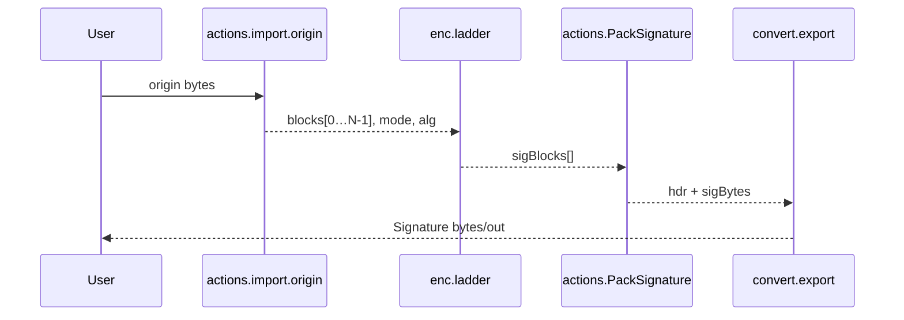

# 1 Introduction  

**UldaSign** is the *reference* JavaScript implementation of the digital-signature method used in **ULDA — Universal Linear Data Auth**.  
Designed for laboratory evaluation, rapid prototyping and comparative analysis of ULDA parameters, the code has **no external run-time dependencies** except for *optional* user-supplied hash functions that can be fetched from a CDN.   

## 1.2 Brief overview of the S- and X-ladder protocols  

| Protocol | Construction principle | Resulting properties |
|----------|-----------------------|----------------------|
| **S-ladder (Sequential)** | Each block `blockᵢ` is iteratively hashed *i* times: `hashⁱ(blockᵢ)`. All intermediate digests are stored in the signature. | Straight-line verification of arbitrarily distant generations; signature size grows linearly with *N*. |
| **X-ladder (Cross)** | On every depth *d* the concatenation of two neighbouring blocks is hashed: `hash(blockᵢ ∥ blockᵢ₊₁)`, forming a tree of depth *N − 1*. | More compact signature; verification of generation *k + 1* requires generation *k*. |

The desired ladder type is selected via the constructor field `sign.mode` (`"S"` | `"X"`). :contentReference[oaicite:3]{index=3}  

## 1.3 Key capabilities of the implementation  

* **Origin generation (`New`)** – produces an array of *N* pseudo-random blocks of size `originSize` bits and packs them into a self-contained binary container.  
* **Incremental update (`stepUp`)** – discards the oldest Origin block, appends a new random block and increments the generation counter; all previous signatures remain valid.  
* **Signature creation (`sign`)** – applies the chosen ladder algorithm and serialises the result in `hex`, `base64` or `bytes` format, according to `fmt.export`.  
* **Integrity check (`verify`)** – confirms that signature *B* is the direct successor of signature *A* (for *S* or *X* mode) or rejects the chain unambiguously.  
* **Pluggable hash functions** – arbitrary digest algorithms can be registered via the `externalHashers` map; the class automatically verifies output length and supports `bytes`, `hex` or `base64` return types.  
* **Minimal public API** – only five methods are exposed: `New`, `stepUp`, `sign`, `verify`, and the static helper `loadScriptOnce`, simplifying both formal specification and security analysis. :contentReference[oaicite:4]{index=4}  


## 2 Getting Started

> This chapter shows how to obtain **UldaSign**, launch the reference build in typical environments, and understand every configuration flag.<br>
> Sections for **npm** and **CDN** delivery are placeholders until the artefacts are published.

---

### 2.1 Installation

| Method | Instruction |
|--------|-------------|
| **npm** | *coming soon* |
| **CDN** | *coming soon* |
| **Local script (development build)** | 1. Copy `main.js` next to your HTML page.<br>2. Load it **before** your own code (see the snippet below). |

```html
<!-- UldaSign reference build -->
<script src="main.js"></script>
<script>
  /* your app */
</script>
```

---

### 2.2 Quick smoke test (in-browser)

```html
<script src="main.js"></script>
<script>
  const signer = new UldaSign({
    fmt : { export : 'hex' },           // hex | base64 | bytes
    sign: { N: 5, mode: 'X', hash: 'SHA-256', originSize: 256 }
  });

  (async () => {
    const origin0 = await signer.New();        // generation 0
    const sig0    = await signer.sign(origin0);

    const origin1 = await signer.stepUp(origin0);
    const sig1    = await signer.sign(origin1);

    console.log(await signer.verify(sig0, sig1)); // → true
  })();
</script>
```
A similar pattern is demonstrated in the bundled `index.html`. 

---

### 2.3 Running the demo page

Open **index.html** in any modern browser and watch the console output.  
The script continuously generates *Origin / Signature* pairs and prints `verify()` results for successive generations. 

---

### 2.4 Node.js usage

```js
import UldaSign from './main.js';      // adjust the path if necessary

const signer = new UldaSign({ sign: { N: 3 } });

const origin = await signer.New();
console.log(await signer.sign(origin));
```
> **Note:** If you rely on custom hash functions in Node .js, register them via `externalHashers`. Browser-only APIs such as `crypto.subtle.digest` are **not** available in vanilla Node.

---

### 2.5 Configuration reference

| Path | Type / Allowed values | Default | Description |
|------|----------------------|---------|-------------|
| `version` | `string` | `"1"` | Binary-header revision (change **only** if you alter the on-wire layout).  |
| `fmt.export` | `'hex'` \| `'base64'` \| `'bytes'` | `"hex"` | Serialisation format for `Origin` and `Signature`.  |
| `sign.N` | `integer ≥ 2` | `5` | Ladder length (number of Origin blocks). Affects signature size and chain lifetime.  |
| `sign.mode` | `'S'` (sequential) \| `'X'` (cross) | `'S'` | Ladder construction algorithm (see § 1.2).  |
| `sign.hash` | Built-ins: `"SHA-1"`, `"SHA-256"`, `"SHA-384"`, `"SHA-512"`, `"SHA3-256"`, `"SHA3-512"`, `"BLAKE3"`, `"WHIRLPOOL"` – **or** any custom short name | `"SHA-256"` | Digest algorithm. Custom names must be registered via `externalHashers`.  |
| `sign.originSize` | `integer` (bits) | `256` | Size of each Origin block. In **X-mode** this **must equal** the digest length of `sign.hash`.  |
| `sign.pack` | `'simpleSig'` | `"simpleSig"` | Packing strategy for the signature payload (reserved).  |
| `sign.func` | `async (Uint8Array) → Uint8Array \| string` | — | Raw hashing callback for **custom** algorithms. Registered implicitly when present.  |
| `sign.output` | `'bytes'` \| `'hex'` \| `'base64'` | `'bytes'` | Output format produced by `sign.func`; auto-converted to bytes.  |
| `sign.size` | `integer` (bits) | — | Expected digest length for custom hashes; enforced at run-time if provided.  |
| `sign.cdn` | `string` (URL) | — | Script exporting `sign.func`, loaded on first use.  |
| `externalHashers` | `object` `{ id → { fn, output, size, cdn } }` | `{}` | Pre-register multiple custom hashes at construction time.  |

#### Example – registering a custom hash

```js
import * as hashwasm from 'hash-wasm';    // any WASM digest library

const cfg = {
  fmt : { export : 'bytes' },
  sign: {
    N: 5,
    mode: 'X',
    hash: 'WHIRLPOOL',          // identifier you will use later
    originSize: 512,            // must equal digest size
    func  : async u8 => hashwasm.whirlpool(u8),
    output: 'hex'               // format returned by the function
  }
};

const signer = new UldaSign(cfg);
```

When `sign()` is invoked for the first time, **UldaSign** wraps the custom function, converts its output to bytes, checks `size` (if supplied) and then proceeds exactly as with the built-in algorithms.

---

With these settings you can fine-tune **UldaSign** for almost any laboratory scenario: vary the chain length, switch between *S*- and *X*-ladders, benchmark different digest algorithms or plug in post-quantum candidates – all without changing application code.


# 3 Configuration (`cfg`)

> All behaviour of **UldaSign** is driven by a single configuration object
> that you pass to the constructor.<br>
> This chapter specifies every field, its default, validation rules and
> several ready‑to‑use recipes.  :contentReference[oaicite:6]{index=6}

---

## 3.1 Default object (reference build)

The constructor merges your input with the defaults below:

```json
{
  "version": "1",
  "fmt":   { "export": "hex" },
  "sign":  {
    "N": 5,
    "mode": "S",
    "hash": "SHA-256",
    "originSize": 256,
    "pack": "simpleSig",

    /* custom‑digest descriptors (optional) */
    "func": null,
    "output": "bytes",
    "size": null,
    "cdn": null
  },

  /* optional bulk registration */
  "externalHashers": {}
}
```

Any field you omit inherits the value shown above.  
Unknown properties are ignored for forward compatibility.

---

## 3.2 `fmt` — serialisation options

| Field | Allowed values | Default | Effect |
|-------|----------------|---------|--------|
| `export` | `'hex'` \| `'base64'` \| `'bytes'` | `'hex'` | Output format for `New`, `sign`, `stepUp`; determines the parser used by `verify`. :contentReference[oaicite:7]{index=7} |

---

## 3.3 `sign` — ladder‑engine parameters

### 3.3.1 Core fields

| Field | Type / Range | Default | Description |
|-------|--------------|---------|-------------|
| `N` | integer ≥ 2 | `5` | Number of **Origin** blocks; upper bound on chain lifetime. |
| `mode` | `'S'` (sequential) \| `'X'` (cross) | `'S'` | Ladder construction algorithm (see § 1.2). |
| `hash` | built‑in ID or custom string | `'SHA‑256'` | Digest used by the ladder engine. |
| `originSize` | integer (bits) | `256` | Size of each Origin block.<br>**Must equal** digest length in **X‑mode**. |
| `pack` | `'simpleSig'` | `'simpleSig'` | Signature‑payload layout (reserved for future use). |

### 3.3.2 Digest selection

*Built‑in identifiers*  
`"SHA‑1"`, `"SHA‑256"`, `"SHA‑384"`, `"SHA‑512"`,  
`"SHA3‑256"`, `"SHA3‑512"`, `"BLAKE3"`, `"WHIRLPOOL"` :contentReference[oaicite:8]{index=8}

*Custom identifier* — any short string not colliding with the list above.

If you choose a custom ID, supply **at least one** of the descriptors below:

| Descriptor | Purpose | Required? |
|------------|---------|-----------|
| `func` | `async (Uint8Array) → Uint8Array \| string` | yes (if no `cdn`) |
| `cdn` | URL exporting `func` | yes (if no `func`) |
| `output` | `'bytes'` \| `'hex'` \| `'base64'` | **always** |
| `size` | integer (bits) | recommended (enforced at run‑time) |

`UldaSign` converts `output` to raw bytes and checks `size` before use.  
If the digest is missing or returns the wrong length, the class throws:

* `Hasher &lt;id&gt; not registered` — unknown `hash` :contentReference[oaicite:9]{index=9}  
* `Hasher &lt;id&gt; size mismatch` — digest length ≠ `size` :contentReference[oaicite:10]{index=10}

### 3.3.3 Validation flow

1. Constructor fills defaults, then stores the merged object.  
2. During **X‑mode** verification, `originSize` ≡ digest length; mismatch causes `verify()` to return `false`. :contentReference[oaicite:11]{index=11}  
3. All binary importers (`import.origin`, `import.signature`) check header markers, block counts and lengths; violations throw:  
   * `"sentinel"` — leading/trailing marker ≠ 0  
   * `"div"` — body length not divisible by `N`  
   * `"SigImporter sizes"` — signature payload inconsistent with `originSize` / `N`

---

## 3.4 `externalHashers` — bulk registration map

Use this map to preload several custom digests at once:

```js
const cfg = {
  sign: { hash: 'BLAKE3' },         // default digest for this run
  externalHashers: {
    WHIRLPOOL: {                    // override built‑in
      output: 'hex',
      size:   512,
      cdn:    'https://cdn.example.com/whirlpool.js'
    },
    MYHASH: {
      func:   async u8 => myHash(u8),
      output: 'bytes',
      size:   256
    }
  }
};
```

The descriptor format is **identical** to § 3.3.2.

---

## 3.5 Ready‑to‑use configuration recipes

### 3.5.1 Minimal secure setup (built‑in SHA‑256)

```js
new UldaSign({
  sign: { N: 10 }     // everything else = defaults
});
```

### 3.5.2 Long sequential chain (32 blocks, BLAKE3, raw bytes)

```js
new UldaSign({
  fmt : { export: 'bytes' },
  sign: { N: 32, mode: 'S', hash: 'BLAKE3', originSize: 256 }
});
```

### 3.5.3 Custom digest via direct `func` (Whirlpool, 512‑bit)

```js
import * as hashwasm from 'hash-wasm';

new UldaSign({
  fmt : { export: 'bytes' },
  sign: {
    N: 5,
    mode: 'X',
    hash: 'WHIRLPOOL',
    originSize: 512,                 // equals digest size
    func:   async u8 => hashwasm.whirlpool(u8),
    output: 'hex'                    // function returns hex string
  }
});
```

### 3.5.4 Digest loaded on demand from CDN (PQ candidate)

```js
new UldaSign({
  sign: {
    N: 7,
    mode: 'X',
    hash: 'SPHINCS-SHAKE',
    originSize: 256,
    cdn:   'https://cdn.example.com/sphincs-shake.js',
    output:'bytes',
    size:  256
  }
});
```

At first `sign()` call **UldaSign** fetches the script once, registers
`SPHINCS‑SHAKE` and proceeds as with built‑ins.

---

## 3.6 Error table (configuration phase)

| Condition | Thrown value / effect |
|-----------|----------------------|
| Unknown `hash` ID during hashing | `Hasher <id> not registered` |
| Digest returns wrong length | `Hasher <id> size mismatch` |
| Invalid header sentinel | `"sentinel"` |
| Body length not divisible by `N` | `"div"` |
| Signature payload inconsistent | `"SigImporter sizes"` |

All other mis‑configurations result in `verify()` silently returning `false`.

---

With these rules and examples you can predict on‑wire layout,
signature size and verification cost for any ULDA experiment, while
keeping configuration files short and self‑explanatory.


# 4 High‑level Architecture

> This section shows **how the pieces inside `UldaSign` fit together**:  
> which modules exist, how data flows between them, and what computational
> guarantees each ladder provides.  The focus is on public‑level structure;
> internal helpers are mentioned only when they clarify the big picture.  
> (Function names and code excerpts are referenced to the source file.)  
> :contentReference[oaicite:6]{index=6}

---

## 4.1 Layer map

| Layer | Main symbols / files | Responsibility |
|-------|----------------------|----------------|
| **Public API** | `New`, `stepUp`, `sign`, `verify`, `loadScriptOnce` | Minimal surface exposed to users. |
| **Domain actions** | `actions.*` object | Orchestrates imports, exports, ladder selection, verification logic. |
| **Crypto primitives** | `enc.hash`, `enc.hashIter`, `enc.ladder`, `enc._ladderS`, `enc._ladderX` | Pure hash utilities; no I/O. |
| **Byte utilities** | `convert.*` toolbox | Encoding/decoding, concatenation, constant‑time compare. |
| **Static tables** | `encoder`, `decoder` maps | Numeric codes ↔ human IDs for mode & algorithm fields. |

A single public call (e.g. `sign(pkg)`) never bypasses these layers; it
travels **top → bottom → top**, guaranteeing separation of concerns.

---

## 4.2 Data‑flow snapshots

### 4.2.1 `New()` → first Origin package

```mermaid
graph TD
    subgraph domain
        OG[OriginGenerator] --> NE[NewExporter]
    end
    OG -.crypto.rand.-> RB[RandomBlock]
    NE --> exportFmt((convert.export))
    exportFmt --> "Origin bytes/out"
```

1. `actions.OriginGenerator` builds *N* random blocks via `RandomBlock`.  
2. `NewExporter` prepends binary header `_hdr` and serialises with  
   `convert.export` (hex / base64 / bytes).  
3. No cryptography is executed yet. :contentReference[oaicite:7]{index=7}

### 4.2.2 `sign(originPkg)`



* The ladder engine itself never sees headers – only **raw blocks** and
  the chosen algorithm/mode.

### 4.2.3 `verify(sigA, sigB)`

* `actions.import.signature` parses both packages and checks header
  compatibility (`N`, `mode`, `alg`).  
* Branch by `mode`:  
  ‑ **S** → `VerifyS` (gap‑tolerant, hashes ∑i)  
  ‑ **X** → `VerifyX` (requires *exactly* one generation gap).  
* Result is a strict boolean; any parsing failure short‑circuits to
  `false` rather than throwing. :contentReference[oaicite:8]{index=8}

---

## 4.3 Utility module `convert`

* **Format codecs** – `bytes↔hex`, `bytes↔base64`, auto‑detect `guessToBytes`.  
* **Concatenation / equality** – `concatBytes`, `equalBytes`
  (constant‑time compare).  
* **Index packing** – `indexToBytes` stores big‑endian generation counters
  of arbitrary size.  
* **Unified exporter / importer** – respect global `fmt.export`,
  so the rest of the code never cares about representation.  
  :contentReference[oaicite:9]{index=9}

---

## 4.4 Crypto primitives `enc`

| Symbol | Role | Notes |
|--------|------|-------|
| `hash(u8, alg)` | Router to built‑in `crypto.subtle.digest` **or** a custom hasher from `externalHashers`. | Lazy CDN loading via `loadScriptOnce`. |
| `hashIter(u8, t)` | Applies `hash` **t** times. | Used by S‑ladder & gap verification. |
| `_ladderS` | Sequential hashing of each block *i* times. | Complexity&nbsp;≈ *N(N‑1)/2* hashes. |
| `_ladderX` | Tree of pairwise hashes layer‑by‑layer. | Complexity&nbsp;≈ *N(N‑1)/2* hashes; first block echoed for compatibility. |
| `ladder(blocks, mode)` | Thin selector between the two internal functions. |

No function in `enc` mutates global state; that makes them trivially
unit‑testable. :contentReference[oaicite:10]{index=10}

---

## 4.5 Domain layer `actions`

* **Importers** – strict header validation (`sentinel`, sizes, divisors).  
* **Exporters** – assemble `_hdr`, append body, call `convert.export`.  
* **VerifyS / VerifyX** – implement algorithm‑specific checks only;
  they rely on `enc.hash` and `convert.equalBytes` for the heavy lifting.  
* **StepUp** – rotates block array in memory, appends a new random tail,
  then re‑exports as a fresh Origin (generation +1).  
  :contentReference[oaicite:11]{index=11}

---

## 4.6 Complexity & channel resilience

| Ladder | Honest sign cost | Honest verify cost* | Forgery work factor† | Channel assumption |
|--------|------------------|---------------------|----------------------|--------------------|
| **S** | `∑_{i=0}^{N-1} i = N(N‑1)/2` hashes | `g` hashIter for a gap `g` | `≈ 2^{hashLen}` | Robust to *any* gap (packets may be skipped, reordered, replayed). |
| **X** | Same order, but hashes pairs, not iterations | `N‑1` pair‑hash checks (only if gap = 1) | `≈ 2^{hashLen} × (N‑1)` | Requires *strictly sequential* delivery (socket‑volatile, TLS/SSH, etc.). |

\* Counting only cryptographic operations.  
† Classical pre‑image search; ignores side‑channel shortcuts.

*Takeaway*: **S‑ladder** is latency‑robust but produces larger signatures
and quadratic hashing. **X‑ladder** compresses the signature and amplifies
attack cost linearly in `N`, yet verification succeeds **only** when every
generation reaches the verifier in order and exactly once.

---

## 4.7 Extensibility surface (public)

1. **Pluggable digests** ‑ supply `func/output/size` or `cdn` in the
   constructor, or preload several via `externalHashers`.  
2. **Signature layout** ‑ `sign.pack` reserved for future schemes; existing
   code routes by header byte, so new packers stay backward‑compatible.  
3. **Export formats** – add another codec in `convert.export` and register
   the reverse in `importToBytes`; no other change required.  
4. **Header codes** – extend `encoder.algorithm` / `mode` maps without
   touching validation logic.

All these hooks are *documented* and reachable through the public
constructor – no private field manipulation is needed.

---

With this layered design **UldaSign** keeps the public surface minimal,
while every internal piece remains replaceable or testable in isolation.
